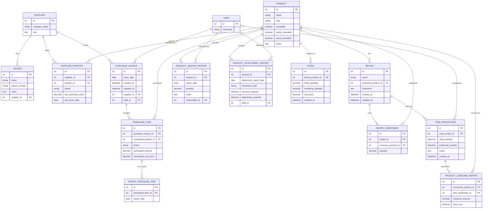

# Inventory Module

## Purpose

Manages products, suppliers, invoices, stock, recipes, production, and reports.
Keeps track of product availability, expiry dates, purchase history, and production costs.

---

## General Scenario

1. A supplier sends an invoice → `PurchaseInvoice` is created.
2. Each invoice contains `PurchaseItem` records (product, amount, unit price).
3. If products are expiry-traceable → `ExpiryPurchaseItem` is recorded.
4. Each purchase also updates/creates a `SupplierProduct` entry with last purchase price and date.
5. Stock is increased by purchased items → stored in `Stock`.
6. When producing a menu item:
   - Recipe (`Recipe` + `RecipeComponent`) defines required inputs.
   - `ItemProduction` deducts from stock using FIFO.
   - `ProductConsumeReport` records consumed items & costs.
   - Produced products can be traced in stock.
7. Reports can be generated:
   - `ProductAdjustmentReport` → human adjustments.
   - `ProductWastedReport` → waste or expiry losses.
   - `Supplier` & `Visitor` → supplier info & contacts.
   - `PurchaseInvoice` & `PurchaseItem` → purchase history.

---

## Models Overview

### Product

- Fields: `name`, `expiry_traceable`, `notes`, `countable`, `type`, `stock_traceable`
- Rules: Unique (`name`, `type`)

### Supplier

- Fields: `company_name`, `info`
- Rules: Unique `company_name`

### SupplierProduct

- Fields: `supplier`, `product`, `brand`, `last_purchase_price`, `last_price_date`
- Rules: Unique (`supplier`, `product`, `brand`)

### Visitor

- Fields: `name`, `phone_number`, `notes`, `related_supplier`
- Rules: Unique `phone_number`

### PurchaseInvoice

- Fields: `issue_date`, `staff`, `supplier`
- Rules: staff must be active

### PurchaseItem

- Fields: `purchase_invoice`, `purchased_product`, `purchased_amount`, `purchased_unit_price`
- Rules: Unique (`purchase_invoice`, `purchased_product`)

### ExpiryPurchaseItem

- Fields: `purchased_item`, `expiry_date`

### Stock

- Fields: `stored_product`, `initial_quantity`, `unit_price`, `remaining_quantity`, `created_at`
- Rules: delete if `remaining_quantity = 0`

### Recipe

- Fields: `name`, `produced_product`, `instruction`, `timestamped`
- Rules: Unique `name`

### RecipeComponent

- Fields: `recipe`, `consume_product`, `quantity`
- Rules: Unique (`recipe`, `consume_product`)

### ItemProduction

- Fields: `used_recipe`, `used_quantity`, `produced_quantity`, `cooperators`, `notes`, `timestamped`

### ProductConsumeReport

- Fields: `consumed_product`, `item_production_record`, `consume_amount`, `total_cost`

### ProductWastedReport

- Fields: `product`, `waste_date`, `quantity`, `notes`, `responsible`

### ProductAdjustmentReport

- Fields: `product`, `adjustment_report_date`, `movement_type`, `previous_quantity`, `adjustment_quantity`, `staff`

---

## Mermaid Diagram

